# Pre-requisite Network Namespaces

  - Take me to [Lecture](https://kodekloud.com/topic/prerequsite-network-namespaces/)

In this section, we will take a look at **Network Namespaces**


## Process Namespace

> On the container
```
$ ps aux      
```

> On the host
```
$ ps aux 

```

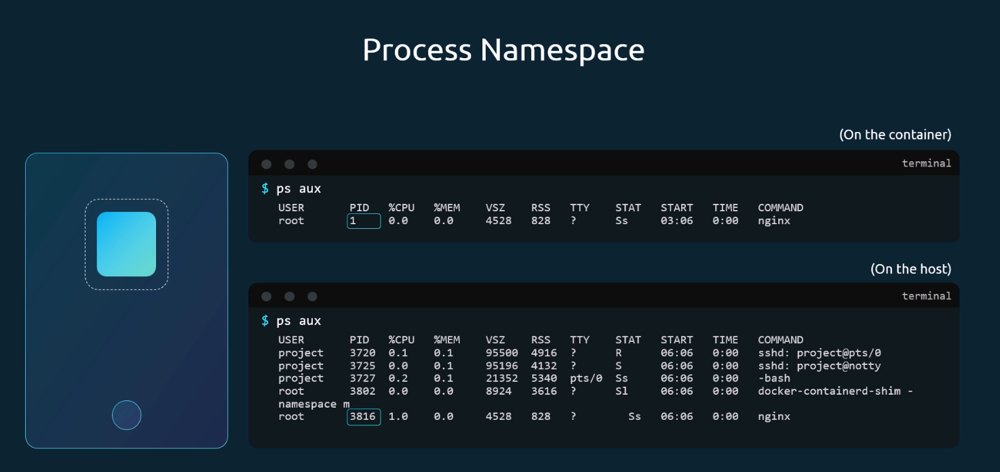

## Network Namespace

```
$ route
```

```
$ arp
```

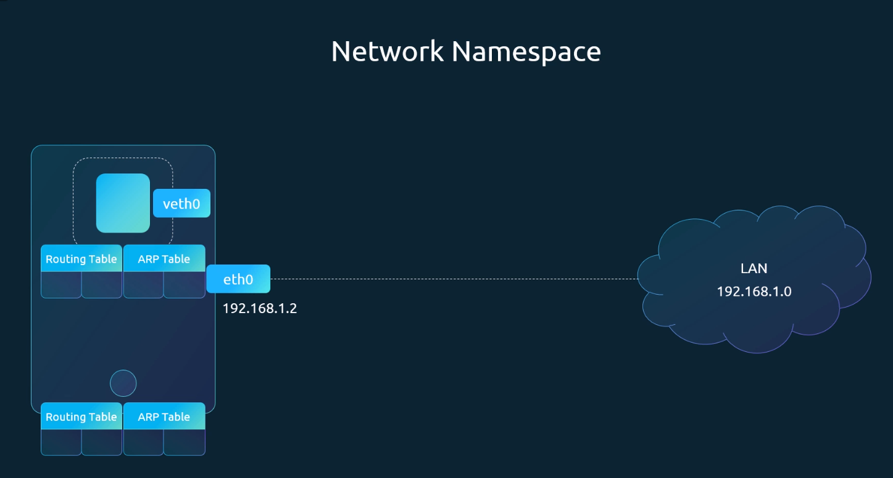


## Create Network Namespace

```
$ ip netns add red

$ ip netns add blue
```
- List the network namespace

```

$ ip netns
```

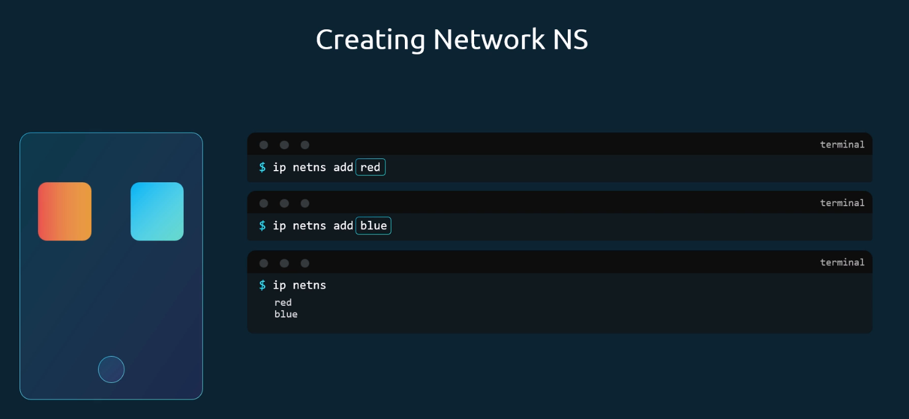


## Exec in Network Namespace

- List the interfaces on the host

```
$ ip link
```

- Exec inside the network namespace

```
$ ip netns exec red ip link
1: lo: <LOOPBACK> mtu 65536 qdisc noop state DOWN mode DEFAULT group default qlen 1000
    link/loopback 00:00:00:00:00:00 brd 00:00:00:00:00:00

$ ip netns exec blue ip link
1: lo: <LOOPBACK> mtu 65536 qdisc noop state DOWN mode DEFAULT group default qlen 1000
    link/loopback 00:00:00:00:00:00 brd 00:00:00:00:00:00
```
- You can try with other options as well. Both works the same.
```
$ ip -n red link
1: lo: <LOOPBACK> mtu 65536 qdisc noop state DOWN mode DEFAULT group default qlen 1000
    link/loopback 00:00:00:00:00:00 brd 00:00:00:00:00:00
```

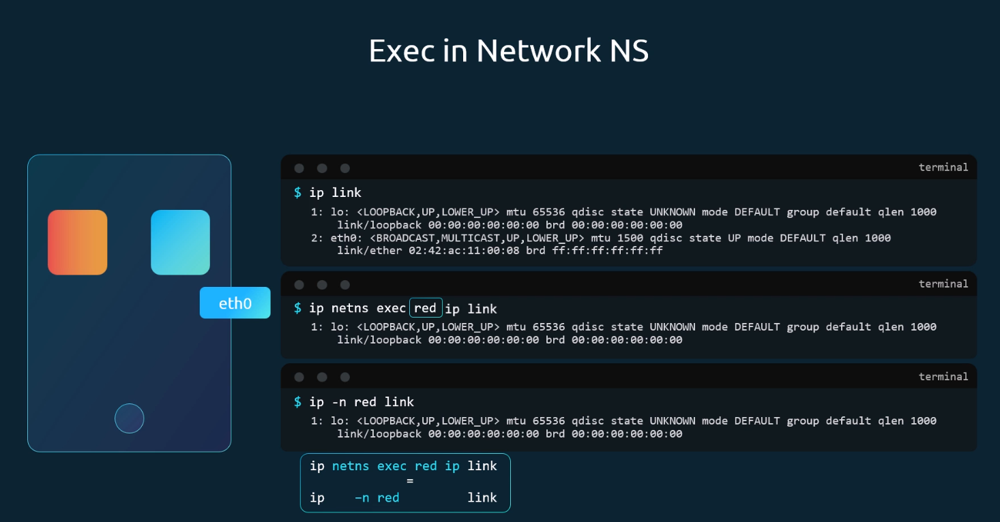


## ARP and Routing Table

> On the host
```
$ arp
Address                  HWtype  HWaddress           Flags Mask            Iface
172.17.0.21              ether   02:42:ac:11:00:15   C                     ens3
172.17.0.55              ether   02:42:ac:11:00:37   C                     ens3
```

> On the Network Namespace
```
$ ip netns exec red arp
Address                  HWtype  HWaddress           Flags Mask            Iface

$ ip netns exec blue arp
Address                  HWtype  HWaddress           Flags Mask            Iface
```

> On the host 
```
$ route
```

> On the Network Namespace
```
$ ip netns exec red route
Kernel IP routing table
Destination     Gateway         Genmask         Flags Metric Ref    Use Iface

$ ip netns exec blue route
Kernel IP routing table
Destination     Gateway         Genmask         Flags Metric Ref    Use Iface
```

## Virtual Cable

什么是 veth pair（虚拟以太网对）？  
veth 是 Linux 内核提供的一种虚拟网络设备。  
它总是成对出现：一端发送的数据，会立即从另一端收到。  
行为就像一根直通的物理网线（cable）连接两台设备。  
✅ 因此，社区常把 veth pair 比喻为 “Virtual Cable”（虚拟线缆）。  

- To create a virtual cable
```
$ ip link add veth-red type veth peer name veth-blue
```

- To attach with the network namespaces
```
$ ip link set veth-red netns red

$ ip link set veth-blue netns blue
```

- To add an IP address
```
$ ip -n red addr add 192.168.15.1/24 dev veth-red

$ ip -n blue addr add 192.168.15.2/24 dev veth-blue
```

- To turn it up `ns` interfaces
```
$ ip -n red link set veth-red up

$ ip -n blue link set veth-blue up
```

- Check the reachability 
```
$ ip netns exec red ping 192.168.15.2
PING 192.168.15.2 (192.168.15.2) 56(84) bytes of data.
64 bytes from 192.168.15.2: icmp_seq=1 ttl=64 time=0.035 ms
64 bytes from 192.168.15.2: icmp_seq=2 ttl=64 time=0.046 ms

$ ip netns exec red arp
Address                  HWtype  HWaddress           Flags Mask            Iface
192.168.15.2             ether   da:a7:29:c4:5a:45   C                     veth-red

$ ip netns exec blue arp
Address                  HWtype  HWaddress           Flags Mask            Iface
192.168.15.1             ether   92:d1:52:38:c8:bc   C                     veth-blue

```

- Delete the link.
```
$ ip -n red link del veth-red
```

> On the host
```
# Not available
$ arp
Address                  HWtype  HWaddress           Flags Mask            Iface
172.16.0.72              ether   06:fe:61:1a:75:47   C                     ens3
172.17.0.68              ether   02:42:ac:11:00:44   C                     ens3
172.17.0.74              ether   02:42:ac:11:00:4a   C                     ens3
172.17.0.75              ether   02:42:ac:11:00:4b   C                     ens3
```

## Linux Bridge

- Create a network namespace

```
$ ip netns add red

$ ip netns add blue
``` 
- To create a internal virtual bridge network, we add a new interface to the host
```
$ ip link add v-net-0 type bridge
```
- Display in the host
```
$ ip link
8: v-net-0: <BROADCAST,MULTICAST> mtu 1500 qdisc noop state DOWN mode DEFAULT group default qlen 1000
    link/ether fa:fd:d4:9b:33:66 brd ff:ff:ff:ff:ff:ff
```
- Currently it's down, so turn it up
```
$ ip link set dev v-net-0 up
```
- To connect network namespace to the bridge. Creating a virtual cabel
```
$ ip link add veth-red type veth peer name veth-red-br

$ ip link add veth-blue type veth peer name veth-blue-br
```
- Set with the network namespaces
```
$ ip link set veth-red netns red

$ ip link set veth-blue netns blue

$ ip link set veth-red-br master v-net-0

$ ip link set veth-blue-br master v-net-0
```
- To add an IP address
```
$ ip -n red addr add 192.168.15.1/24 dev veth-red

$ ip -n blue addr add 192.168.15.2/24 dev veth-blue
```
- To turn it up `ns` interfaces
```
$ ip -n red link set veth-red up

$ ip -n blue link set veth-blue up
```
- To add an IP address
```
$ ip addr add 192.168.15.5/24 dev v-net-0
```

在同一节点上，执行ping 192.168.15.1，能连通  

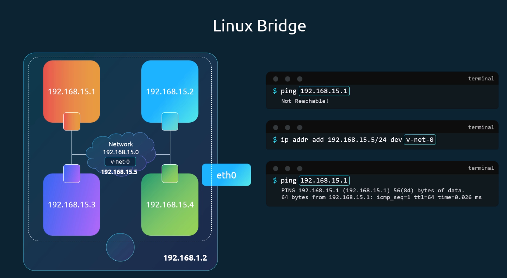


- Turn it up added interfaces on the host
```
$ ip link set dev veth-red-br up
$ ip link set dev veth-blue-br up
```

> On the host
```
$ ping 192.168.15.1
```

> On the ns
```
$ ip netns exec blue ping 192.168.1.1
Connect: Network is unreachable

$ ip netns exec blue route

$ ip netns exec blue ip route add 192.168.1.0/24 via 192.168.15.5

# Check the IP Address of the host
$ ip a

$ ip netns exec blue ping 192.168.1.1
PING 192.168.1.1 (192.168.1.1) 56(84) bytes of data.

$ iptables -t nat -A POSTROUTING -s 192.168.15.0/24 -j MASQUERADE

$ ip netns exec blue ping 192.168.1.1

$ ip netns exec blue ping 8.8.8.8

$ ip netns exec blue route

$ ip netns exec blue ip route add default via 192.168.15.5

$ ip netns exec blue ping 8.8.8.8
```

在blue netns里执行 ping 192.168.1.3失败。   
在blue netns 查看路由信息(route)  

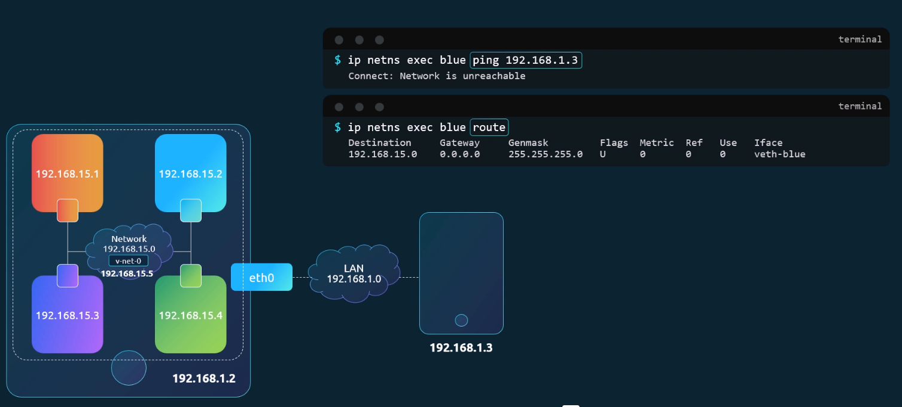


在blue netns 添加路由信息  
ip netns exec blue ip route add 192.168.1.0/24 via 192.168.15.5  
但是在blue netns里执行 ping 192.168.1.3依然失败。     

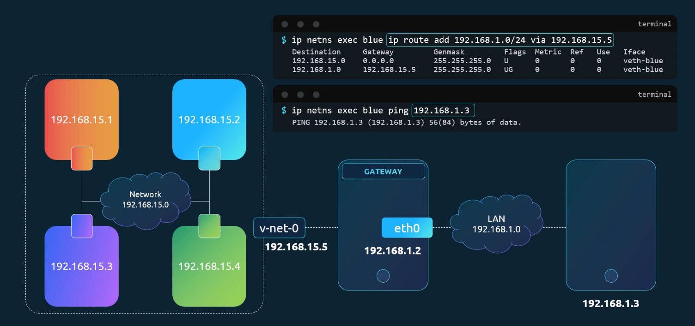

必须添加一条iptable规则  
iptables -t nat -A POSTROUTING -s 192.168.15.0/24 -j MASQUERADE  

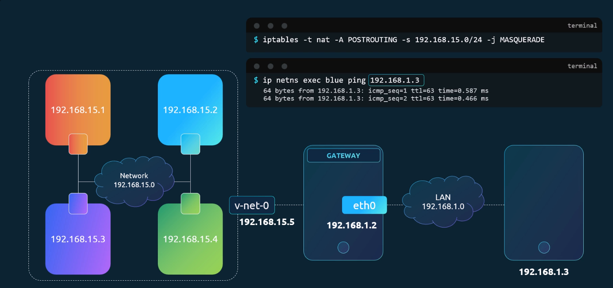

```bash
iptables -t nat -A POSTROUTING -s 192.168.15.0/24 -j MASQUERADE
```
 
在blue netns ping 互联网，不通  

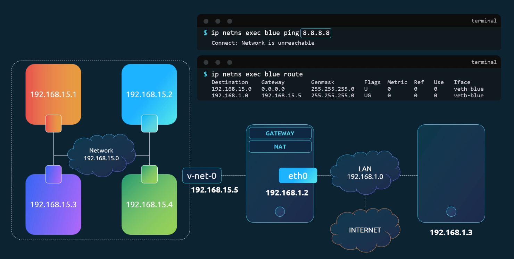

添加一条路由规则    
ip netns exec blue ip route add default via 192.168.15.5  

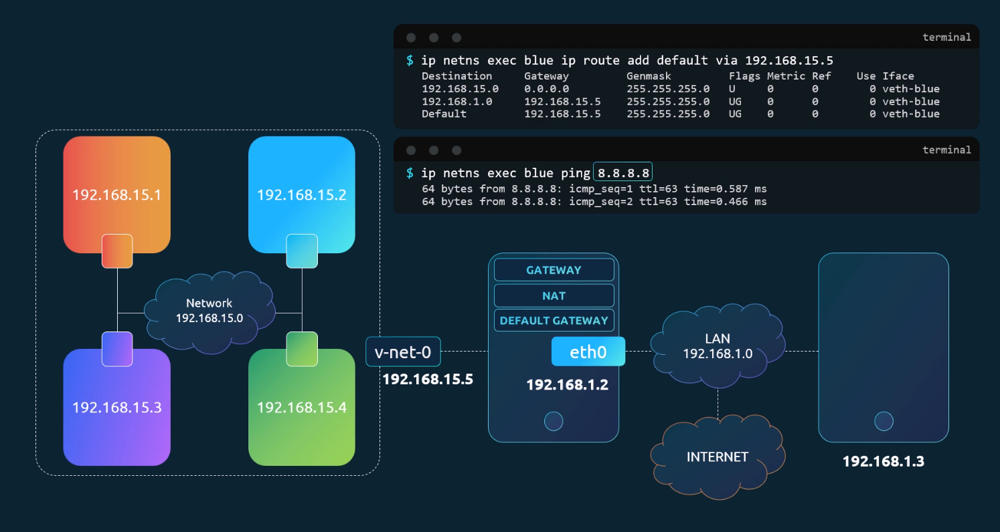


## 🔍 命令解释（逐部分解析）

| 部分 | 含义 |
|------|------|
| iptables | Linux 内核中的包过滤和网络地址转换（NAT）工具 |
| -t nat | 指定使用 nat 表（Network Address Translation），用于处理 NAT 相关规则（如 SNAT、DNAT、MASQUERADE） |
| -A POSTROUTING | 在 POSTROUTING 链 的末尾追加一条规则<br>→ POSTROUTING 是数据包即将离开本机前的最后一个阶段，常用于出站 NAT |
| -s 192.168.15.0/24 | 匹配源 IP 地址为 192.168.15.0/24 网段的数据包（即从该子网发出的流量） |
| -j MASQUERADE | 将匹配的数据包进行 "伪装"（Masquerade），即自动修改其源 IP 为本机的公网 IP |

## 🎯 整体含义

这条命令的作用是：

允许来自 192.168.15.0/24 子网的设备访问外部网络，并自动将它们的私有 IP 替换为本机的公网 IP（或外网接口 IP），实现"NAT 出口"功能。

这在以下场景中非常常见：

- 家庭路由器让内网电脑上网
- Kubernetes 中 Node 上的 Pod 访问外网
- 云服务器作为网关，为多个虚拟机提供互联网访问

## 🔧 工作原理示例

假设：

- 你的主机 IP 是 203.0.113.10（公网）
- 内部有一个设备 192.168.15.100 想访问 www.baidu.com

数据包流程：

1. 192.168.15.100 发送请求 → 目标：www.baidu.com
2. 请求经过你的主机（网关），触发 POSTROUTING 链
3. 规则匹配：-s 192.168.15.0/24 → 是
4. 执行 MASQUERADE：
   - 修改源 IP 从 192.168.15.100 → 203.0.113.10
   - 并记录映射关系（连接跟踪表）
5. 发送到公网，百度服务器看到的是 203.0.113.10 发来的请求
6. 回复包返回时，通过连接跟踪还原成原始源 IP，发回给 192.168.15.100

## ⚠️ 注意事项

### MASQUERADE vs SNAT

- **MASQUERADE**：自动获取当前外网接口的 IP（适合动态 IP，如拨号上网）
- **SNAT**：需要手动指定目标 IP（适用于静态 IP）

示例对比：

```bash
# MASQUERADE（推荐用于动态 IP）
iptables -t nat -A POSTROUTING -s 192.168.15.0/24 -j MASQUERADE

# SNAT（指定固定 IP）
iptables -t nat -A POSTROUTING -s 192.168.15.0/24 -j SNAT --to-source 203.0.113.10
```

### 必须启用 IP 转发

```bash
echo 1 > /proc/sys/net/ipv4/ip_forward
```

否则数据包不会被转发。

### 永久生效

可以用 iptables-save + iptables-restore 或写入 /etc/rc.local 自动加载。

## ✅ 总结

| 项目 | 说明 |
|------|------|
| 作用 | 实现内网设备通过网关访问外网（NAT 出口） |
| 适用场景 | 家庭路由、K8s、虚拟机网络、云服务器等 |
| 关键机制 | 使用 MASQUERADE 自动替换源 IP |
| 依赖条件 | 必须开启 ip_forward 和正确配置路由 |


- Adding port forwarding rule to the iptables

```
$ iptables -t nat -A PREROUTING --dport 80 --to-destination 192.168.15.2:80 -j DNAT
```
```
$ iptables -nvL -t nat
```

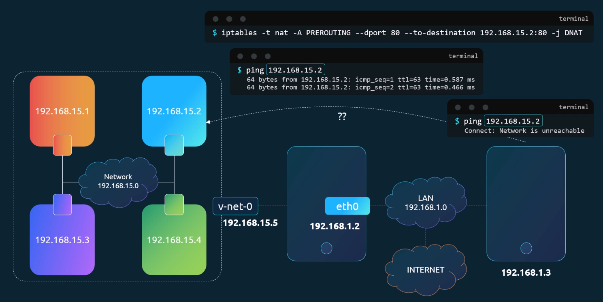


```bash
arp
Address                  HWtype  HWaddress           Flags Mask            Iface
172.17.0.2               ether   ae:57:3a:8d:e4:eb   C                     cni0
172.17.1.0               ether   6e:8e:a0:96:4c:24   CM                    flannel.1
169.254.1.1              ether   ee:ee:ee:ee:ee:ee   C                     eth0
172.17.0.3               ether   fe:ec:ff:cf:2a:97   C                     cni0
```

你提供的是一段 Linux 系统中 `arp -a` 或 `/proc/net/arp` 的输出，显示了当前主机的 ARP（Address Resolution Protocol）缓存表。ARP 表用于将 IP 地址映射到对应的 MAC 地址（即硬件地址 HWaddress），以便在局域网内通信。

## 逐行解释：

### 1. `172.17.0.2               ether   ae:57:3...   C                     cni0`

- **IP 地址**：172.17.0.2
- **硬件类型**：ether（以太网）
- **MAC 地址**：ae:57:3a:8d:e4:eb
- **Flags**：C → 表示该条目是"Complete"（完整的），即已成功解析并缓存。
- **接口**：cni0 → 这是一个由容器网络接口（CNI，如 Kubernetes 使用的 Flannel、Calico 等）创建的虚拟网桥，通常用于连接 Pod。
- **说明**：这个 IP 很可能属于某个容器（Pod），通过 CNI 插件分配。

### 2. `172.17.1.0               ether   6e:8e:a...   CM                    flannel.1`

- **IP 地址**：172.17.1.0
- **⚠️ 注意**：这是一个网络地址（不是主机地址），正常情况下不会作为目标通信地址。但在使用 VXLAN 或 overlay 网络（如 Flannel） 时，Flannel 会为每个节点的子网在 flannel.1 接口上注册一个"伪 MAC"，用于跨主机通信。
- **MAC 地址**：6e:8e:a0:96:4c:24
- **Flags**：CM
  - C = Complete
  - M = "Published" 或 "Multicast"（在某些实现中表示该条目是由本地主动发布的，用于代理 ARP）
- **接口**：flannel.1 → 这是 Flannel 创建的 VXLAN 虚拟接口，用于跨节点通信。
- **说明**：这是 Flannel overlay 网络的典型表现。172.17.1.0 实际代表另一个节点的 Pod 子网（例如该节点负责 172.17.1.0/24），通过 VXLAN 封装转发流量。

### 3. `169.254.1.1              ether   ee:ee:ee...   C                     eth0`

- **IP 地址**：169.254.1.1
- **MAC 地址**：ee:ee:ee:ee:ee:ee（这是一个特殊值，常用于虚拟化或测试）
- **接口**：eth0（主物理/虚拟网卡）
- **说明**：169.254.0.0/16 是链路本地地址（Link-Local），通常在没有 DHCP 时自动分配。但这里 169.254.1.1 很可能是某些云平台（如 AWS、GCP）或虚拟化环境（如 QEMU、libvirt）用于主机与虚拟机通信的特殊网关或 metadata 服务地址。ee:ee:... 是常见的虚拟 MAC 前缀。

### 4. `172.17.0.3               ether   fe:ec:ff...   C                     cni0`

- 类似第一行：
  - 属于另一个容器（Pod）
  - IP：172.17.0.3
  - MAC：fe:ec:ff:cf:2a:97
  - 也在 cni0 网桥上

## 总结

你的系统很可能是一个 Kubernetes 节点，使用 Flannel 作为 CNI 插件（VXLAN 模式）：

- **cni0**：本地 Pod 网桥，连接本机所有 Pod（如 .2, .3）
- **flannel.1**：VXLAN 隧道接口，用于和其他节点通信（如 172.17.1.0 代表另一节点的子网）
- **eth0** 上的 169.254.1.1 可能是云平台或虚拟化环境的特殊服务地址

这些 ARP 条目共同支持容器跨主机通信和本地网络解析。


```bash
iptables -t nat -A PREROUTING -p tcp --dport 80 -j DNAT --to-destination 192.168.15.2:80
```

## 🔑 关键修正：

- 添加 -p tcp：指定协议为 TCP（HTTP 使用 TCP）
- 将 --to-destination 放在 -j DNAT 之后（顺序很重要）

## 🔍 命令逐部分解释

| 部分 | 含义 |
|------|------|
| iptables | Linux 防火墙/NAT 工具 |
| -t nat | 操作 NAT 表（用于地址转换） |
| -A PREROUTING | 在 PREROUTING 链 末尾添加规则<br>→ 此链在数据包刚进入主机、路由决策之前触发，适合做 DNAT（目标地址转换） |
| -p tcp | 仅匹配 TCP 协议 的流量 |
| --dport 80 | 仅匹配 目标端口为 80 的数据包（即访问本机 80 端口的请求） |
| -j DNAT | 执行 目标地址转换（Destination NAT） |
| --to-destination 192.168.15.2:80 | 将数据包的目标 IP 和端口改为 192.168.15.2:80 |

## 🎯 整体作用（场景举例）

假设你的主机公网 IP 是 203.0.113.10，运行上述规则后：

- 外部用户访问 http://203.0.113.10
- 数据包到达你的主机，目标是 203.0.113.10:80
- iptables 在 PREROUTING 阶段将其目标地址修改为 192.168.15.2:80
- 主机根据路由表将包转发给内网服务器 192.168.15.2
- 内网 Web 服务器处理请求并返回响应
- ✅ 实现了 "公网 IP 的 80 端口 → 内网 Web 服务器" 的端口转发

## ⚠️ 必须配合的其他设置

仅靠这条规则还不够！还需要：

### 1. 开启 IP 转发

```bash
echo 1 > /proc/sys/net/ipv4/ip_forward
# 永久生效：在 /etc/sysctl.conf 中设置 net.ipv4.ip_forward=1
```

### 2. 确保 FORWARD 链允许流量通过

```bash
iptables -A FORWARD -d 192.168.15.2 -p tcp --dport 80 -j ACCEPT
iptables -A FORWARD -s 192.168.15.2 -p tcp --sport 80 -j ACCEPT
```

### 3. （可选）回程 SNAT/MASQUERADE（如果内网服务器网关不是本机）

如果 192.168.15.2 的默认网关不是这台主机，还需添加：

```bash
iptables -t nat -A POSTROUTING -s 192.168.15.2 -j MASQUERADE
```

否则回包可能无法正确返回。

## 🔄 DNAT vs MASQUERADE 对比

| 规则类型 | 链（Chain） | 用途 | 示例 |
|----------|-------------|------|------|
| DNAT | PREROUTING | 修改目标地址（外部 → 内部） | 公网访问 → 内网 Web |
| MASQUERADE/SNAT | POSTROUTING | 修改源地址（内部 → 外部） | 内网上网 → 伪装成网关 IP |

## ✅ 总结

| 项目 | 说明 |
|------|------|
| 目的 | 将访问本机 80 端口的流量转发到内网 192.168.15.2:80 |
| 正确命令 | iptables -t nat -A PREROUTING -p tcp --dport 80 -j DNAT --to-destination 192.168.15.2:80 |
| 依赖条件 | 开启 ip_forward + 允许 FORWARD 流量 |
| 典型应用 | 反向代理、负载均衡前置、暴露内网服务 |

💡 这是构建 "跳板机"、"网关服务器" 或 "Kubernetes NodePort" 类似功能 的底层原理之一。
