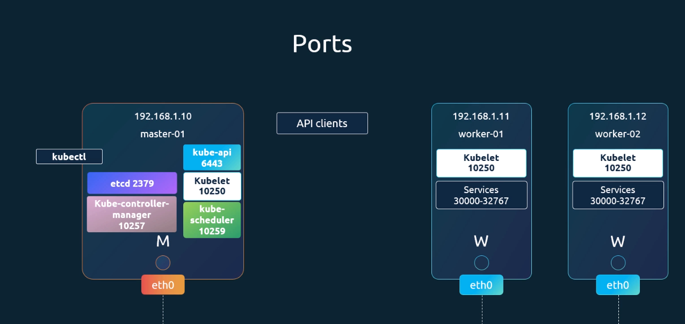
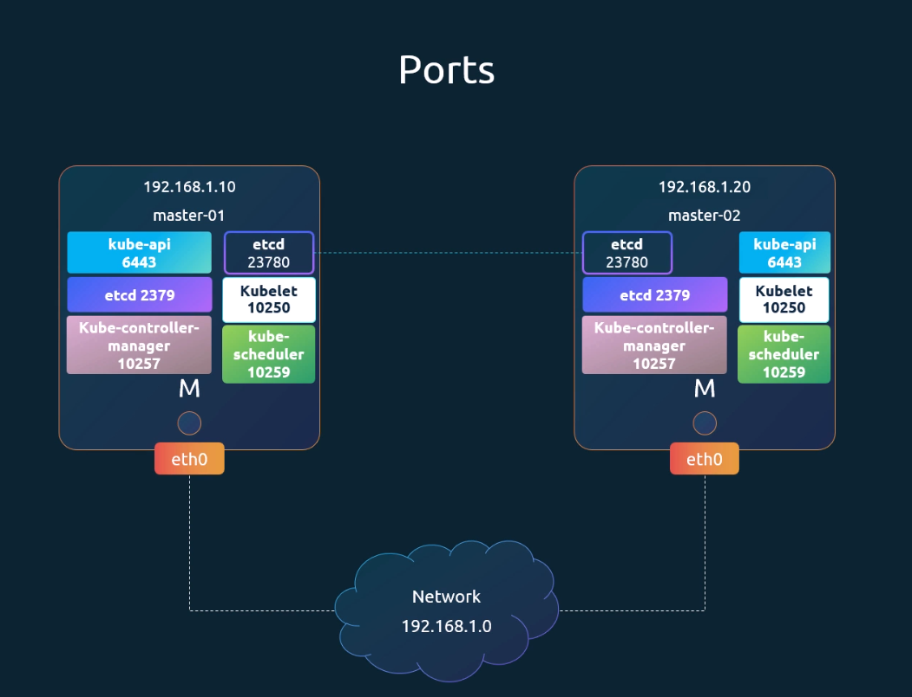

# Pre-requisite Cluster Networking

  - Take me to [Lecture](https://kodekloud.com/topic/cluster-networking/)

In this section, we will take a look at **Pre-requisite of the Cluster Networking**

- Set the unique hostname.
- Get the IP addr of the system (master and worker node).
- Check the Ports.

## IP and Hostname

- To view the hostname

```
$ hostname 
```

- To view the IP addr of the system

```
$ ip a
```


## Set the hostname

```
$ hostnamectl set-hostname <host-name>

$ exec bash
```

## View the Listening Ports of the system

```
$ netstat -nltp
```





| 组件 | 端口 | 用途 |
|------|------|------|
| kube-api | 6443 | Kubernetes API Server 的监听端口，所有客户端（kubectl、Dashboard、其他组件）通过此端口与集群交互。使用 HTTPS 加密。 |
| etcd | 2379 | etcd 的客户端端口（用于读写数据）。Master 节点上的 kube-apiserver 会通过这个端口访问 etcd 存储集群状态。 |
| etcd | 23780 | etcd 的 Peer 端口（集群内部通信用），用于 etcd 成员之间同步数据（如心跳、复制等）。 |
| Kube-controller-manager | 10257 | 控制器管理器的监听端口，负责运行各种控制器（如 Node Controller、Replication Controller）。 |
| Kubelet | 10250 | Kubelet 的 API 端口，用于与 apiserver 通信，报告节点状态、接收 Pod 指令。 |
| kube-scheduler | 10259 | 调度器的端口，负责为新创建的 Pod 分配合适的节点。 |

#### etcd Peer 端口（如 2380 / 23780）具体做什么？

当多个 etcd 实例组成集群时，它们需要通过 Peer 端口进行以下关键操作：

#### ✅ (1) 成员发现与加入

新节点启动时，通过已知的 Peer 地址（如 http://192.168.1.10:2380）加入集群。

#### ✅ (2) Raft 共识协议通信

etcd 使用 Raft 算法 保证数据一致性，Peer 端口用于：

- Leader 选举（哪个节点是主节点）
- 日志复制（Leader 将写操作日志同步给 Follower）
- 心跳检测（Leader 定期发心跳，确认 Follower 是否存活）

#### ✅ (3) 数据同步

当你在 Kubernetes 中创建一个 Pod：

- kube-apiserver 写入数据到 etcd（通过 2379）
- etcd Leader 接收到后，通过 Peer 端口（2380） 将该写操作同步给其他 etcd 节点
- 多数节点确认后，写入成功



```bash
netstat -nltp

Active Internet connections (only servers)

Proto Recv-Q Send-Q Local Address           Foreign Address         State       PID/Program name    

tcp        0      0 0.0.0.0:22              0.0.0.0:*               LISTEN      977/sshd: /usr/sbin 

tcp        0      0 0.0.0.0:8080            0.0.0.0:*               LISTEN      979/ttyd            

tcp        0      0 192.168.59.150:2379     0.0.0.0:*               LISTEN      2912/etcd           

tcp        0      0 192.168.59.150:2380     0.0.0.0:*               LISTEN      2912/etcd           

tcp        0      0 127.0.0.1:42031         0.0.0.0:*               LISTEN      975/containerd      

tcp        0      0 127.0.0.1:10257         0.0.0.0:*               LISTEN      2954/kube-controlle 

tcp        0      0 127.0.0.1:10259         0.0.0.0:*               LISTEN      2891/kube-scheduler 

tcp        0      0 127.0.0.1:10249         0.0.0.0:*               LISTEN      4079/kube-proxy     

tcp        0      0 127.0.0.1:10248         0.0.0.0:*               LISTEN      3629/kubelet        

tcp        0      0 127.0.0.1:2379          0.0.0.0:*               LISTEN      2912/etcd           

tcp        0      0 127.0.0.1:2381          0.0.0.0:*               LISTEN      2912/etcd           

tcp6       0      0 :::22                   :::*                    LISTEN      977/sshd: /usr/sbin 

tcp6       0      0 :::6443                 :::*                    LISTEN      2955/kube-apiserver 

tcp6       0      0 :::8888                 :::*                    LISTEN      3810/kubectl        

tcp6       0      0 :::10250                :::*                    LISTEN      3629/kubelet

tcp6       0      0 :::10256                :::*                    LISTEN      4079/kube-proxy
```

## netstat -nltp 命令详解

`netstat -nltp` 是一个在 Linux 系统中常用的网络诊断命令，用于查看当前系统中监听的 TCP 端口及其对应的进程信息。下面逐个解释每个选项的含义：

### 🔹 命令分解：netstat -n l t p

| 选项 | 含义 |
|------|------|
| -n | 以数字形式显示地址和端口号（不解析为主机名、服务名）。<br>例如：显示 :6443 而不是 :https-alt。 |
| -l | 仅显示"监听"（LISTEN）状态的套接字。<br>即只列出正在等待连接的服务端口。 |
| -t | 仅显示 TCP 协议的连接/监听端口。<br>（不包括 UDP、Unix 套接字等） |
| -p | 显示占用该端口的进程 PID 和进程名。<br>⚠️ 需要 root 权限才能看到所有进程的信息。 |


#### References Docs

- https://kubernetes.io/docs/setup/production-environment/tools/kubeadm/install-kubeadm/#check-required-ports
- https://kubernetes.io/docs/concepts/cluster-administration/networking/
