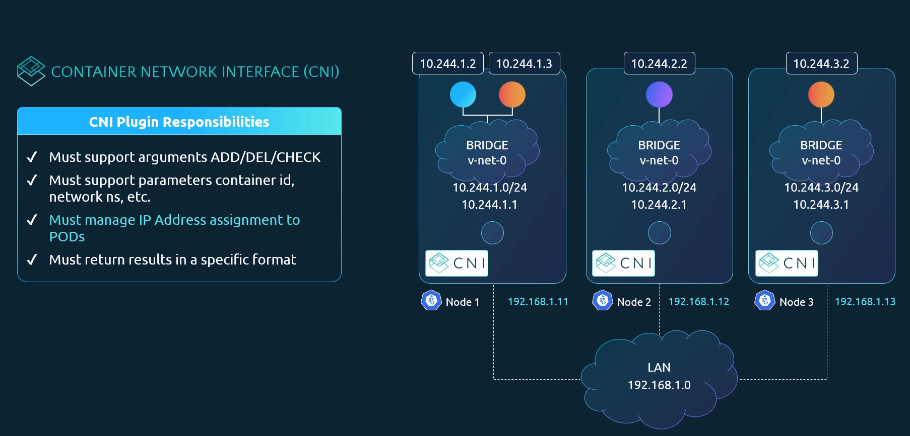
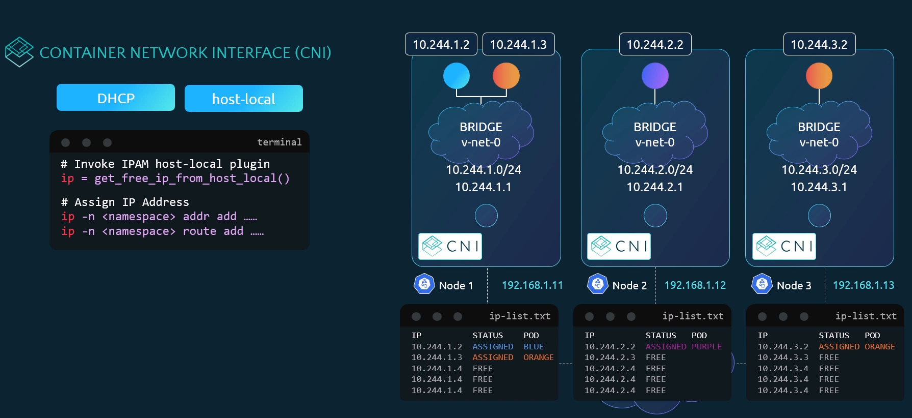
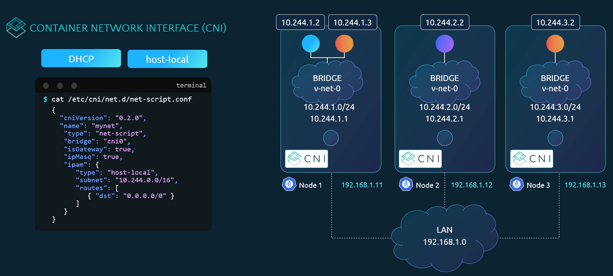

# IPAM weave

  - Take me to [Lecture](https://kodekloud.com/topic/ipam-weave/)

- IP Address Management in the Kubernetes Cluster











# host-local CNI 插件详解

host-local 是 CNI（Container Network Interface）中的一种 IPAM（IP Address Management）插件，用于为容器（Pod）分配 IP 地址。

下面我来详细解释 host-local 的作用、工作原理以及它与 DHCP 的区别。

## 🔹 什么是 host-local？

host-local 是一个 轻量级的 CNI IPAM 插件，它的核心功能是：

✅ 在每个节点上本地管理一个 IP 地址池，并为 Pod 分配唯一的 IP 地址，避免重复或冲突。

它属于 CNI 插件中的"IPAM"部分，通常和网络插件（如 bridge、calico、flannel 等）配合使用。

## 🔹 host-local 的工作原理

### 📌 核心机制：基于文件的 IP 分配

- 每个节点上维护一个本地文件（例如 /var/lib/cni/networks/mynet/ip-list.txt）
- 文件中记录了哪些 IP 已被分配（ASSIGNED）、哪些可用（FREE）
- 当创建 Pod 时，CNI 调用 host-local 插件从这个列表中选择一个空闲 IP
- 分配后标记为 "ASSIGNED"，防止重复使用

### 👉 示例：

```txt
IP           STATUS     POD
10.244.1.2   ASSIGNED   BLUE
10.244.1.3   ASSIGNED   ORANGE
10.244.1.4   FREE       -
```

## 🔹 图解说明（结合你的图）

在你的图中：

```json
"ipam": {
  "type": "host-local",
  "subnet": "10.244.0.0/16",
  "routes": [ { "dst": "0.0.0.0/0" } ]
}
```

这表示：

- 使用 host-local 来管理 IP 地址
- 每个节点从 10.244.0.0/16 中划出自己的子网（如 Node1: 10.244.1.0/24）
- 每个节点自己负责分配该子网内的 IP
- 所有 Pod 的默认路由指向 0.0.0.0/0（即通过网关转发）

💡 注意：虽然配置里写了 10.244.0.0/16，但实际每个节点只用自己那一段（如 10.244.1.0/24），由 host-local 自动处理。

## 🔹 host-local vs DHCP

| 特性 | host-local | DHCP |
|------|------------|------|
| 是否需要中央服务器 | ❌ 不需要 | ✅ 需要 DHCP Server |
| 分配方式 | 本地文件记录 | 动态请求响应 |
| 可靠性 | 高（无单点故障） | 依赖 DHCP 服务 |
| 复杂度 | 简单，适合小规模 | 更复杂，需部署服务 |
| 适用场景 | Kubernetes 内部网络（如 kubeadm 默认） | 宿主机或传统网络环境 |

✅ 所以 host-local 更适合 Kubernetes 这类分布式系统，因为它不需要额外的服务，仅靠本地文件就能完成 IP 分配。

## 🔹 实际运行流程（结合你的代码）

```bash
# Invoke IPAM host-local plugin
ip = get_free_ip_from_host_local()

# Assign IP Address
ip -n <namespace> addr add ...
ip -n <namespace> route add ...
```

这表示：

- CNI 调用 host-local 插件获取一个未使用的 IP
- 将该 IP 分配给容器的网络命名空间（namespace）
- 设置路由规则，确保能通信

## 🔹 优点与缺点

### ✅ 优点：

- ✅ 简单可靠：无需外部服务
- ✅ 高性能：本地读写文件，速度快
- ✅ 去中心化：每个节点独立管理，无单点故障
- ✅ 易于调试：可以查看 ip-list.txt 文件了解状态

### ❌ 缺点：

- ❌ 不支持跨节点动态分配：不能自动协调多个节点之间的 IP 使用（但 Kubernetes 一般通过每个节点独立子网解决）
- ❌ 不支持 IPv6 或高级策略（相比一些更复杂的 IPAM 插件）

## 🔹 常见使用场景

host-local 是以下情况的常见选择：

- 使用 kubeadm 搭建的 Kubernetes 集群（默认 CNI 插件之一）
- 本地开发测试环境（如 minikube、kind）
- 简单的桥接网络（bridge + host-local）

⚠️ 注意：生产环境中，很多项目会使用 Calico、Flannel、Cilium 等更强大的 CNI 插件，它们可能内置更复杂的 IPAM（如 crd、etcd 存储等），但 host-local 仍然是理解 CNI 的基础。

## ✅ 总结

| 项目 | 内容 |
|------|------|
| host-local 是什么？ | CNI 的 IPAM 插件，用于本地分配 IP |
| 作用？ | 为 Pod 分配唯一 IP，避免冲突 |
| 如何工作？ | 通过本地文件记录已分配 IP（如 ip-list.txt） |
| 与 DHCP 区别？ | 不依赖外部服务器，更适合 Kubernetes |
| 是否推荐？ | 对于学习和简单环境非常推荐；生产可选更复杂方案 |

如果你正在学习 Kubernetes 网络，理解 host-local 是掌握 CNI 架构的关键一步！

---

## DHCP 的全称是什么？

DHCP 的全称是 Dynamic Host Configuration Protocol，中文译为 动态主机配置协议。

### 简要说明：

DHCP 是一种网络协议，用于在局域网（LAN）中自动分配 IP 地址及其他网络配置参数（如子网掩码、默认网关、DNS 服务器地址等）给客户端设备（如计算机、手机、容器等），而无需手动配置。

### 主要功能包括：

- 自动分配 IP 地址（可设置租期）
- 避免 IP 地址冲突
- 集中管理网络配置
- 支持临时（动态）或固定（保留）IP 分配

### 工作流程（四步）：

- DISCOVER：客户端广播请求"有没有 DHCP 服务器？"
- OFFER：DHCP 服务器回应"我可以给你这个 IP"
- REQUEST：客户端请求"我要这个 IP"
- ACK：服务器确认"好的，IP 已分配给你"

这个过程常被简称为 DORA（Discover, Offer, Request, Acknowledge）。

虽然在 Kubernetes CNI 中较少使用 DHCP（因依赖外部服务），但在传统数据中心、家庭路由器、虚拟机网络等场景中非常常见。


## References Docs

- https://www.weave.works/docs/net/latest/kubernetes/kube-addon/
- https://kubernetes.io/docs/concepts/cluster-administration/networking/ 
