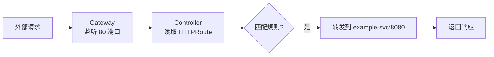
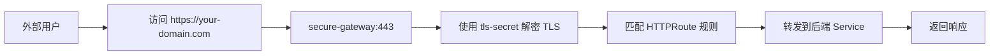

# Gateway API 核心组件详解

展示了 Kubernetes Gateway API 的核心组件及其工作流程，是 Kubernetes 网络入口（Ingress）的下一代标准。它通过三个关键资源：GatewayClass、Gateway 和 HTTPRoute，实现了更强大、可扩展、标准化的流量管理。

## 🎯 图片内容总览

| 组件 | 作用 |
|------|------|
| GatewayClass | 定义"谁来实现"网关功能（如 Nginx、Envoy、Traefik） |
| Gateway | 实际运行的"监听器"（Listener），暴露端口并接收外部流量 |
| HTTPRoute | 定义路由规则（如路径匹配、域名、转发目标） |

### 🔗 三者关系：

```
GatewayClass → Gateway → HTTPRoute
```

（从抽象到具体）

## 🔍 逐个解析

### 1. ✅ GatewayClass —— "控制器类型定义"

```yaml
# gateway-class.yaml
apiVersion: gateway.networking.k8s.io/v1
kind: GatewayClass
metadata:
  name: example-class
spec:
  controllerName: example.com/gateway-controller
```

- 作用：声明一个"网关控制器"的实现。
- controllerName: 指定哪个控制器负责处理该类 Gateway（例如 nginx-ingress-controller 或 envoy-gateway）。
- 类似于"插件注册"，告诉 Kubernetes："我有一个叫 example-class 的网关类型，由 example.com/gateway-controller 来实现"。

#### 📌 示例：

- 如果你用的是 nginx，controllerName 可能是 k8s.nginx.org/nginx。
- 这是实现多租户和多控制器共存的基础。

### 2. ✅ Gateway —— "实际的入口点"

```yaml
# gateway.yaml
apiVersion: gateway.networking.k8s.io/v1
kind: Gateway
metadata:
  name: example-gateway
spec:
  gatewayClassName: example-class
  listeners:
  - name: http
    protocol: HTTP
    port: 80
```

- 作用：在集群中创建一个实际的网络入口（类似 Ingress Controller 的 Service）。
- gatewayClassName: 关联到某个 GatewayClass，表示"使用哪种控制器实现"。
- listeners: 定义监听器，包括：
  - 协议（HTTP、HTTPS、TCP、UDP）
  - 端口（如 80、443）
  - 是否启用 TLS 等
- ⚠️ 注意：Gateway 不直接绑定后端服务，而是通过 HTTPRoute 来关联。

### 3. ✅ HTTPRoute —— "路由规则"

```yaml
# http-route.yaml
apiVersion: gateway.networking.k8s.io/v1
kind: HTTPRoute
metadata:
  name: example-httproute
spec:
  parentRefs:
    - name: example-gateway
  hostnames:
    - "www.example.com"
  rules:
  - matches:
    - path:
        type: PathPrefix
        value: /login
    backendRefs:
    - name: example-svc
      port: 8080
```

- 作用：定义如何将流量路由到后端服务。
- parentRefs: 指定该 Route 绑定到哪个 Gateway（即"挂载"到哪个入口）。
- hostnames: 支持基于域名的路由（如 www.example.com）。
- rules:
  - matches: 匹配条件（路径前缀 /login、方法、Header 等）
  - backendRefs: 转发目标（Service 名称 + 端口）
- ✅ 优势：支持复杂的匹配逻辑（如 header、cookie）、多协议、TLS 配置等。

## 🔄 整体工作流程



1. 用户访问 http://www.example.com/login
2. 流量到达 example-gateway 的 80 端口
3. Gateway Controller 查找所有绑定到该 Gateway 的 HTTPRoute
4. 找到 example-httproute，匹配 hostname: www.example.com 和 path: /login
5. 将请求转发到 example-svc:8080

## ✅ 总结：Gateway API 的三大优势

| 优势 | 说明 |
|------|------|
| ✅ 标准化 | 不再依赖 Controller 特有的注解（如 nginx/traefik），API 一致 |
| ✅ 可扩展性 | 支持 HTTP、HTTPS、TCP、UDP、TLS、GRPC 等多种协议 |
| ✅ 分层设计 | GatewayClass（控制实现）→ Gateway（监听器）→ Route（规则），职责清晰 |

## 💡 对比 Ingress

| 特性 | Ingress | Gateway API |
|------|---------|-------------|
| 标准化 | ❌ 依赖注解，各 Controller 不同 | ✅ 原生支持，统一 API |
| 多协议 | ❌ 主要支持 HTTP/HTTPS | ✅ 支持 TCP、UDP、TLS 等 |
| 路由能力 | ⚠️ 较弱，仅支持 path/host | ✅ 强大，支持 header、method、cookie 等 |
| 控制器隔离 | ❌ 无法区分不同实现 | ✅ 通过 GatewayClass 明确指定 |

## ✅ 结论

Gateway API 是 Kubernetes 入口管理的未来方向，它解决了 Ingress 的诸多局限，提供了更强大、灵活、可移植的网络入口方案。如果你正在构建新系统，建议优先使用 Gateway API。

# Gateway API 配置文件详解

Kubernetes Gateway API 的配置文件（gateway.yaml），定义了一个名为 secure-gateway 的网关资源，用于安全地接收 HTTPS 流量。我们来逐行解析它的含义。

## 📄 完整 YAML 内容

```yaml
apiVersion: gateway.networking.k8s.io/v1
kind: Gateway
metadata:
  name: secure-gateway
spec:
  gatewayClassName: example-gc
  listeners:
  - name: https
    port: 443
    protocol: HTTPS
    tls:
      mode: Terminate
      certificateRefs:
        - kind: Secret
          name: tls-secret
    allowedRoutes:
      kinds:
        - kind: HTTPRoute
```

## 🔍 逐部分解释

### 1. ✅ 基本信息

```yaml
apiVersion: gateway.networking.k8s.io/v1
kind: Gateway
metadata:
  name: secure-gateway
```

- 定义一个 Gateway 类型的资源。
- 名称是 secure-gateway，将在集群中创建一个入口点。

### 2. ✅ 指定控制器实现

```yaml
spec:
  gatewayClassName: example-gc
```

- gatewayClassName: 指定这个 Gateway 使用哪个 GatewayClass 实现。
- example-gc 是一个已存在的 GatewayClass，它关联了某个具体的控制器（如 Nginx、Envoy 或 Traefik）。
- 这样可以让不同团队或环境使用不同的控制器，而无需修改路由规则。

### 3. ✅ 定义监听器（Listener）

```yaml
listeners:
  - name: https
    port: 443
    protocol: HTTPS
```

- 创建一个名为 https 的监听器。
- 监听端口 443（HTTPS 默认端口）。
- 协议为 HTTPS，表示将处理加密流量。

### 4. ✅ TLS 配置（证书终止）

```yaml
tls:
  mode: Terminate
  certificateRefs:
    - kind: Secret
      name: tls-secret
```

- mode: Terminate：表示该 Gateway 会终止 TLS 加密（即解密流量），然后以明文转发给后端服务。
- certificateRefs：
  - 指向一个 Kubernetes Secret 资源，名称为 tls-secret。
  - 该 Secret 必须包含 TLS 证书和私钥（通常通过 kubectl create secret tls 创建）。
- 示例：

```bash
kubectl create secret tls tls-secret \
  --cert=server.crt \
  --key=server.key
```

- ⚠️ 注意：如果设置为 Passthrough，则不会解密流量，而是直接透传给后端（适用于后端自己处理 TLS）。

### 5. ✅ 允许绑定的路由类型

```yaml
allowedRoutes:
  kinds:
    - kind: HTTPRoute
```

- 限制哪些类型的 Route 可以绑定到此 Gateway。
- 这里只允许 HTTPRoute 类型的资源绑定。
- 可选值包括：HTTPRoute, TCPRoute, TLSRoute 等。
- 用于安全控制，防止未经授权的路由（如 TCPRoute）接入。

## 🔄 整体工作流程



## ✅ 总结：这段配置的作用

| 功能 | 说明 |
|------|------|
| 🔐 HTTPS 入口 | 在 443 端口监听 HTTPS 请求 |
| 🛠️ 证书终止 | 使用 tls-secret 中的证书进行 TLS 解密 |
| 🧩 控制器绑定 | 使用 example-gc GatewayClass 实现 |
| 🔒 权限控制 | 只允许 HTTPRoute 绑定，增强安全性 |

# allowedRoutes 字段详解

allowedRoutes 字段在 Kubernetes Gateway API 中的作用是：控制哪些路由（Route）资源可以绑定到特定的监听器（Listener）或网关（Gateway）上，从而实现对流量入口的精细化权限管理和安全隔离。

## 📌 核心目的

### 限制路由绑定范围

防止任意命名空间中的 Route（如 HTTPRoute、TLSRoute）随意将流量导向某个 Gateway，避免未经授权的服务暴露。

### 实现多租户隔离

在共享 Gateway 的场景下（例如多个团队共用一个 Ingress 控制器），通过 allowedRoutes 可以规定：
- 只允许本命名空间的 Route 绑定；
- 或只允许特定命名空间（如 prod-*）的 Route 绑定。

### 增强安全性

避免恶意或错误配置的 Route 劫持流量，确保只有被授权的服务才能通过该 Gateway 暴露。

## 🔧 配置示例

```yaml
apiVersion: gateway.networking.k8s.io/v1
kind: Gateway
spec:
  listeners:
  - name: http
    port: 80
    protocol: HTTP
    allowedRoutes:
      namespaces:
        from: Selector
        selector:
          matchLabels:
            team: backend
```

- `from: Selector + selector`：只允许带有 `team: backend` 标签的命名空间中的 Route 绑定到此监听器。
- 其他选项：
  - `from: All`：允许所有命名空间（默认，不安全）。
  - `from: Same`：仅允许 Gateway 所在命名空间的 Route。

## ✅ 总结

allowedRoutes 是 Gateway API 中用于控制路由绑定权限的关键字段，它通过限制哪些命名空间或哪些 Route 可以使用该 Gateway，实现了安全、隔离、可控的流量入口管理。

# Ingress 的主要局限性

| 局限性 | 说明 |
|--------|------|
| ✅ 缺乏标准化 | CORS 等高级功能依赖 Controller 特有的注解，不同控制器写法完全不同 |
| ✅ 不可移植 | 从 Nginx 切换到 Traefik，必须重写注解 |
| ✅ 功能碎片化 | 每个 Controller 自行实现，导致功能差异大 |
| ✅ 无统一 API | Ingress 本身不提供 spec.cors 字段，只能靠注解"打补丁" |

## ✅ 解决方案：使用 Gateway API（推荐）

Kubernetes 新一代的 Gateway API 提供了标准化的路由配置，支持：

```yaml
apiVersion: gateway.networking.k8s.io/v1
kind: HTTPRoute
spec:
  rules:
  - matches:
    - path:
        value: /api
    backendRefs:
    - name: my-service
  options:
    cors:
      allowOrigins:
        - "https://allowed-origin.com"
      allowMethods: ["GET", "POST"]
      allowCredentials: true
```

## ✅ 优点：

- 原生支持 CORS
- 不依赖 Controller 注解
- 跨控制器兼容性强
- 更清晰、可读性高

## 💡 结论

Ingress 的主要局限在于其对高级功能（如 CORS）的非标准化实现，必须依赖特定 Controller 的注解，导致配置不一致、难以迁移。而 Gateway API 正在解决这些问题，提供更强大、统一的入口管理能力。

如果你正在设计新系统，建议直接采用 Gateway API。
