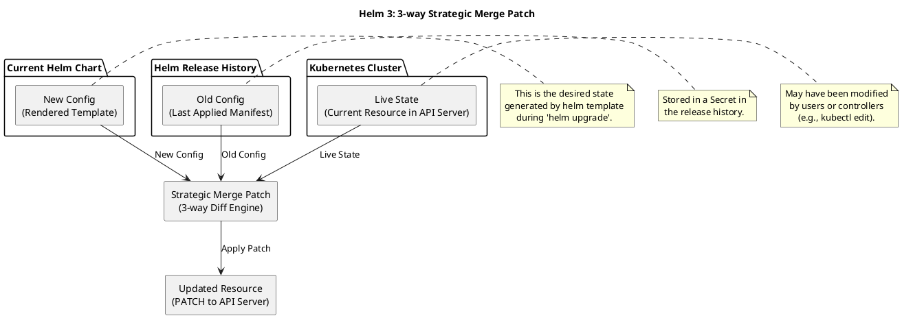

# Helm：Kubernetes 包管理工具

Kubernetes（K8S）中的 Helm 是一个包管理工具，被官方推荐用于简化和标准化 Kubernetes 应用的部署与管理。你可以把它理解为 Kubernetes 的 "APT/YUM/pip" —— 专门用来安装、升级、回滚和卸载 K8S 应用。

## 一、Helm 是什么？

Helm 由以下核心组件构成：

### Chart（图表）
Helm 的"软件包"，是一个包含一组 Kubernetes 资源定义（如 Deployment、Service、ConfigMap 等 YAML 文件）的目录或压缩包。它具有标准结构，支持参数化配置。

### Release（发布）
在 Kubernetes 集群中通过 helm install 安装某个 Chart 后生成的一个具体实例。同一个 Chart 可以多次安装，每次都会生成一个独立的 Release（比如 nginx-prod、nginx-dev）。

### Repository（仓库）
存放多个 Chart 的远程服务器（如 Bitnami、阿里云 Helm 仓库），用户可从中搜索和下载 Chart。

> ⚠️ 注意：Helm v3 已移除服务端组件 Tiller，仅保留客户端 helm 命令行工具，安全性更高、架构更简洁。

## 二、Helm 解决了哪些问题？

在没有 Helm 之前，K8S 应用部署存在以下痛点：

### 1. YAML 文件数量多、维护困难
- 一个应用通常涉及 Deployment、Service、Ingress、ConfigMap、Secret、PVC 等多个资源。
- 每个环境（dev/staging/prod）都需要一套几乎相同但略有差异的 YAML，手动维护成本高。

### 2. 缺乏版本控制与回滚能力
- 手动 kubectl apply 无法自动记录变更历史。
- 出现问题时难以快速回退到上一个稳定状态。

### 3. 重复部署效率低
- 想在多个集群或命名空间部署同一套应用？需要复制粘贴大量 YAML 并逐一手动修改。

### 4. 依赖关系复杂
- 微服务架构下，A 服务依赖 B 数据库、C 缓存，如何统一部署整套依赖？
- Helm 支持 Chart 内声明依赖（Chart.yaml 中定义），自动按顺序部署。

### 5. 配置无法参数化
- 不同环境只需改几个变量（如副本数、镜像 tag、域名），但传统方式需改多个 YAML。
- Helm 通过 values.yaml 提供统一配置入口，模板文件（templates/*.yaml）使用 Go 模板语法动态渲染。

## 三、举个简单例子

你想部署 Nginx：

```bash
# 添加仓库
helm repo add bitnami https://charts.bitnami.com/bitnami

# 搜索 chart
helm search repo nginx

# 安装（自动生成 release）
helm install my-nginx bitnami/nginx

# 升级（比如改副本数）
helm upgrade my-nginx bitnami/nginx --set replicaCount=3

# 查看历史
helm history my-nginx

# 回滚
helm rollback my-nginx 1

# 卸载
helm uninstall my-nginx
```

整个过程无需手写任何 YAML！

## 四、Helm 安装

要使用 Helm，首先需要在你的系统上安装 Helm CLI 工具。以下是几种常见的安装方法：

### 方法一：使用脚本安装

```bash
curl -fsSL -o get_helm.sh https://raw.githubusercontent.com/helm/helm/main/scripts/get-helm-3
chmod 700 get_helm.sh
./get_helm.sh
```

> **注意**：你提供的命令中使用的是 `get-helm-4`，但 Helm 目前最新的主要版本是 v3，因此正确的命令应使用 `get-helm-3`。

### 方法二：使用包管理器安装

**在 macOS 上使用 Homebrew：**
```bash
brew install helm
```

**在 Linux 上使用 Snap：**
```bash
snap install helm --classic
```

**在 Windows 上使用 Chocolatey：**
```cmd
choco install kubernetes-helm
```

## 五、Helm 高级特性

### 调试选项
- **命令行标志**：`--debug` 可用于启用详细输出
- **环境变量**：`$HELM_DEBUG` 可用于指示 Helm 是否在调试模式下运行

### 3-way Strategic Merge Patch
Helm 3 中的 3-way Strategic Merge Patch 是 Helm 在执行 `helm upgrade` 时用于计算如何将新版本的 Kubernetes 资源应用到集群中的一种合并策略。它借鉴了 kubectl apply 所使用的 3-way merge patch 机制，但针对 Helm 的使用场景做了适配。

#### 为什么需要 3-way Strategic Merge Patch？
在 Helm 升级过程中，目标是：
- 将用户提供的新 Chart 模板渲染出的新资源（目标状态）应用到集群
- 同时保留用户或控制器在运行时对资源所做的修改（例如通过 kubectl edit 修改的字段）
- 避免覆盖这些"外部修改"，除非新 Chart 明确改变了对应字段

这就需要一种智能的合并机制——3-way Strategic Merge Patch 正是为此设计。

#### 什么是 "3-way"？
"3-way" 指的是比较三个版本的资源对象：

| 版本 | 说明 |
|------|------|
| 旧配置（Old Config） | 上一次 Helm 安装/升级时提交给集群的资源清单（存储在 Helm 的 Secret 中，作为 release 的历史记录） |
| 当前集群状态（Live State） | 当前实际存在于 Kubernetes 集群中的资源状态（可能被用户或控制器修改过） |
| 新配置（New Config） | 本次 helm upgrade 渲染出的新资源清单 |

Helm 利用这三个版本，计算出一个 patch，使得：
- 如果某个字段在 新配置 和 旧配置 中相同，但 当前集群状态 不同 → 保留集群中的修改（认为是用户有意改动）
- 如果 新配置 改变了某个字段（与旧配置不同）→ 应用新值，覆盖集群中的值（即使用户改过）
- 如果某个字段在新配置中被删除（即不再出现），而旧配置中有 → 从集群中删除该字段（如果该字段支持删除）

#### Strategic Merge Patch 是什么？
这是 Kubernetes 提供的一种 结构感知的合并策略（区别于 JSON Merge Patch 或 JSON Patch）。
- 它知道某些字段是 map、list 或 具有唯一键的数组（如容器列表中的 name 字段）
- 对于 list，它不会简单地替换整个数组，而是根据"合并键"（merge key，如 name）进行元素级别的合并或替换
- 例如，在 Pod 的 spec.containers 中，每个容器有 name 字段。Strategic Merge Patch 会根据 name 来判断是更新已有容器还是新增容器

> 注意：Strategic Merge Patch 依赖于 Kubernetes API schema 中定义的 patchStrategy 和 patchMergeKey 标签。

#### Helm 3 如何使用它？
Helm 在 upgrade 时：
1. 从 release 历史中取出上一次的 manifest（旧配置）
2. 从 API Server 获取当前资源（当前集群状态）
3. 渲染新的模板（新配置）
4. 使用 Kubernetes 的 3-way strategic merge patch 算法 计算差异
5. 将生成的 patch 应用到集群（通过 PATCH 请求）

这样既能升级资源，又能尊重运行时修改（只要新 Chart 没有显式覆盖）。

#### 与 kubectl apply 的异同

| 特性 | kubectl apply | Helm 3 |
|------|---------------|--------|
| 存储旧配置 | 存在资源的 metadata.annotations["kubectl.kubernetes.io/last-applied-configuration"] | 存在 Helm release 的 Secret 中 |
| 使用 3-way merge | ✅ | ✅ |
| 使用 Strategic Merge Patch | ✅ | ✅ |
| 支持 Helm 模板和 release 管理 | ❌ | ✅ |



## 六、Helm Chart 目录结构

这是一个典型的 Helm Chart 目录结构：

```
hello-world-chart
├── templates           # Templates directory
├── values.yaml         # Configurable values
├── Chart.yaml          # Chart information
├── LICENSE             # Chart License
├── README.md           # Readme file
└── charts              # Dependency Charts
```

这是一个标准的 Helm Chart 结构，适用于 Helm 3，包含以下关键文件和目录：

- **templates/**：存放 Kubernetes 资源模板（如 Deployment、Service 等）。
- **values.yaml**：定义可配置的参数，用户可通过 --set 或 values.yaml 覆盖默认值。
- **Chart.yaml**：描述 Chart 的元信息（如名称、版本、描述等）。
- **LICENSE**：Chart 的许可证文件。
- **README.md**：使用说明或文档。
- **charts/**：用于存放依赖的其他 Helm Charts（子 Chart）。

## 七、常用 Helm 命令

### 仓库管理
- **添加仓库**：
  ```bash
  helm repo add bitnami https://charts.bitnami.com/bitnami
  ```
  
- **搜索 Artifact Hub 中的 Chart**：
  ```bash
  helm search hub wordpress
  ```
  
- **从仓库搜索 Chart**：
  ```bash
  helm search repo wordpress
  ```
  
- **列出仓库**：
  ```bash
  helm repo list
  ```
  
- **删除仓库**：
  ```bash
  helm repo remove hashicorp
  ```

### 部署与管理
- **部署应用**：
  ```bash
  helm install amaze-surf bitnami/apache
  ```
  
- **查看发布列表**：
  ```bash
  helm list
  ```
  
- **查看发布历史**：
  ```bash
  helm history nginx-release
  ```
  
- **回滚发布**：
  ```bash
  helm rollback nginx-release 1
  ```
  
- **升级发布**：
  ```bash
  helm upgrade dazzling-web bitnami/nginx --version 18.3.6
  ```
  
- **卸载发布**：
  ```bash
  helm uninstall happy-browse
  ```

## 八、术语解释

- **Chart**：包含在 Kubernetes 集群中运行应用程序、工具或服务所需全部资源定义的 Helm 包
- **Release**：Chart 在集群中的一个具体实例，可以在同一个 Kubernetes 集群中多次安装同一个 Helm Chart，只要每次安装时使用不同的 Release 名称即可
- **Revision**：修订、修订版
- **Version**：版本
- **Vision**：愿景、视力

## 九、总结

| 问题 | Helm 如何解决 |
|------|---------------|
| 多 YAML 管理混乱 | 封装为 Chart，结构清晰 |
| 配置无法复用 | 使用 values.yaml + 模板实现参数化 |
| 无版本控制 | 每次 install/upgrade 自动生成 Release 版本 |
| 无法一键回滚 | helm rollback 快速恢复 |
| 依赖复杂 | Chart 支持声明式依赖管理 |
| 多环境部署繁琐 | 同一 Chart + 不同 values 文件即可适配 dev/staging/prod |

✅ Helm 让 Kubernetes 应用像安装软件一样简单：`helm install <app>`

因此，对于任何在 Kubernetes 上运行非 trivial 应用（尤其是微服务、中间件、数据库等）的团队，Helm 几乎是必备工具。
